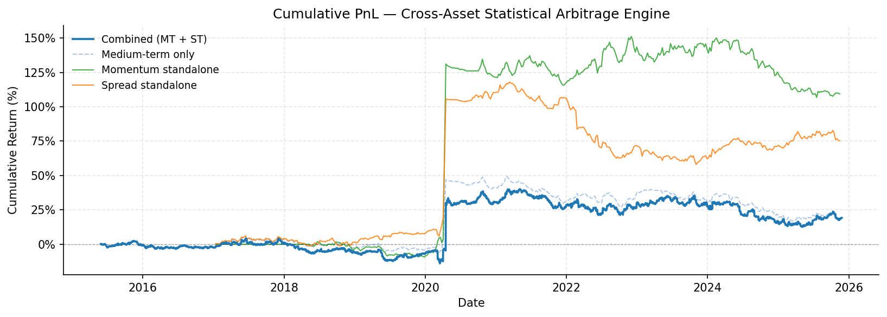
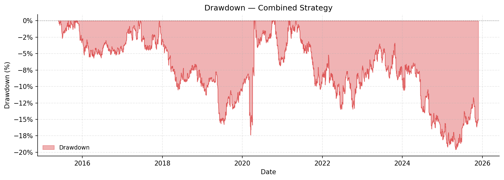
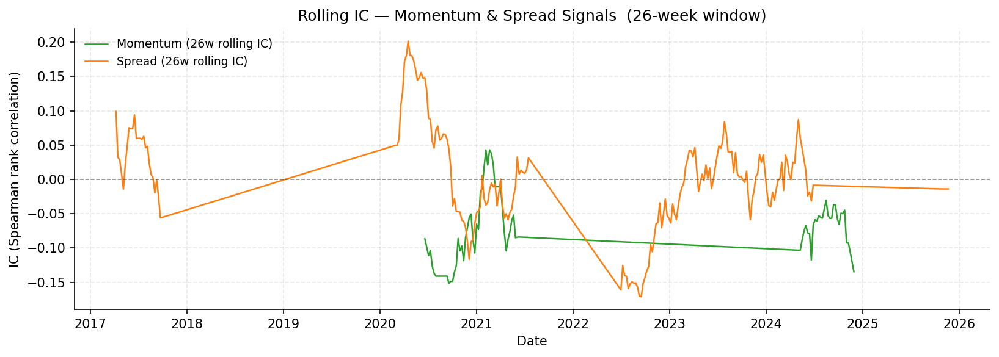
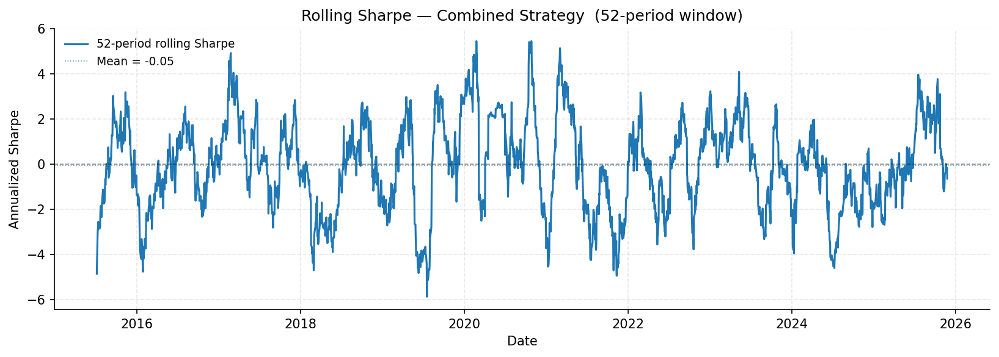

# Cross-Asset Statistical Arbitrage Engine

A modular, production-style portfolio engine for cross-asset systematic strategies.

This repository is a **portfolio construction system**, not a single backtest script.
The included medium-term relative value strategy is an example plug-in used to demonstrate
that the engine runs end-to-end. The goal is system design, modularity, and reproducibility —
not Sharpe maximization.

---

## Architecture

```
data → alpha → portfolio → risk → execution → evaluation
```

| Layer | Role |
|---|---|
| `data` | Daily price/return CSV; loaded and log-transformed at the strategy entry point |
| `alpha` | Signal modules (momentum, spread, reversal); pure functions; no optimizer dependency |
| `portfolio` | Quadratic mean-variance optimizer with turnover regularization; Book abstraction; Allocator |
| `risk` | Ledoit-Wolf covariance; EWMA realized-vol targeting; DCC-GJR GARCH regime detection |
| `execution` | Rebalancing schedule; transaction-cost penalty; per-position limits |
| `evaluation` | Backtest loop inside Book; PnL attribution; report generation |

---

## Core Abstractions

### Alpha

Alpha modules (`engine/alphas/`) are pure functions that return `(T × N)` DataFrames:

```python
build_momentum(residual_ret, skip, window)   -> pd.DataFrame
build_spread(residual_ret, pairs, window, .) -> pd.DataFrame
build_reversal(residual_ret, window)         -> pd.DataFrame
```

Signals are beta-neutralized (rolling OLS vs market), cross-sectionally normalized,
MAD-winsorized, and aligned to expected-return units via rolling Fama-MacBeth regression.
This alignment maps dimensionless z-scores to a scale comparable to weekly returns,
removing the mismatch between signal and optimizer objective that would otherwise produce
arbitrary leverage.

### Book

`engine/portfolio/book.py` — a self-contained, independently testable portfolio unit:

```python
book = Book(
    name="medium_term",
    alpha_df=alpha,       # FM-aligned alpha (T × N)
    cov_dict=cov_dict,    # {date: Ledoit-Wolf Σ} per rebalancing date
    reb_dates=reb_dates,
    gamma=20,             # risk aversion
    kappa=10,             # position inertia
    max_weight=0.07,
    target_vol=0.15,
    ewma_halflife=2,      # weeks; EWMA realized-vol window
    scale_min=0.2,
    scale_max=1.5,
)
result = book.run(returns_df)
# {"pnl", "weights", "sharpe", "max_dd", "turnover", "avg_scale"}
```

A Book owns its alpha, covariance, optimizer parameters, and vol-targeting configuration.
It is **regime-unaware** — regime decisions are made by the Allocator, not inside the Book.
Risk control runs in three layers: (1) a quadratic mean-variance optimizer using Ledoit-Wolf
covariance for relative asset sizing, with a penalty on deviations from previous positions; (2) EWMA power-scaling for portfolio-level vol targeting
(`scale = (target_vol / rv)^2`, bounded to [0.2, 1.5]); (3) hard per-position clip at
`max_weight` as a safety net.

### Allocator

`engine/portfolio/allocator.py` — combines Book outputs:

```python
allocator = Allocator([medium_term_book, short_term_book])
result    = allocator.run(returns_df)
# {"pnl": combined_pnl, "book_results": {name: result_dict}}
```

Regime conditioning enters here. `regime_mapping.get_book_actions()` returns per-Book
activity flags and alpha multipliers based on the current DCC-GARCH regime label
(`normal`, `clustered`, `crowded`, `crisis`, `broken`). This keeps regime logic outside
both the Book and the alpha modules.

---

## Repository Structure

```
engine/
  alphas/
    momentum.py           build_momentum() — 60-day cross-sectional signal
    spread.py             build_spread()   — rolling ADF cointegration pairs
    reversal.py           build_reversal() — short-term mean reversion
  portfolio/
    book.py               Book — independent portfolio unit
    allocator.py          Allocator — combines Book PnL streams
    optimizer.py          chernov_weights() — quadratic mean-variance optimizer with turnover penalty (name retained)
  regime/
    regime_detection.py   compute_regime_signals() — DCC-GJR GARCH labels
    regime_mapping.py     get_book_actions() — regime → Book decisions
  risk/
    dcc_garch/            DCC-GARCH and GJR-GARCH library (vendored)
  backtest/
    report.py             generate_report(), compute_ic(), compute_performance()

strategies/
  medium_term_rv/
    run_engine.py         Entry point — example strategy (momentum + spread)
    run_baseline.py       Reference backtest (monolithic; kept for regression)

reports/
  plot_results.py         Visualization script
  figures/                Output directory for PNG figures
  report_phase2c.json     Last saved report from reference backtest

data/
  raw/
    unified_dataset.csv   Daily returns: 6 commodity futures + 7 sector ETFs + SPX

archive/                  Inactive research artifacts
```

---

## Example Strategy: Medium-Term Relative Value

**Universe**: 6 commodity futures (CLc1, Cc1, HGc1, LCOc1, NGc1, Wc1) and
7 sector ETFs (JETS, XLB, XLE, XLI, XLP, XLU, XLY). 9 cointegration pairs.

**Signals**:
- Momentum (60-day, skip 5): cross-sectional trend on beta-neutralized residual returns
- Spread (120-day rolling OLS + rolling ADF + ECM half-life filter): pairs mean reversion
- Short-term reversal (3-day, futures only, daily rebalancing): separate Book with its own
  optimizer parameters and covariance window

**Combination**: rolling 52-week Sharpe weighting (momentum + spread only at weekly
frequency), shrunk toward equal weights (ν = 0.3), EWM-smoothed (halflife = 4 weeks).

**Risk model**: 120-day Ledoit-Wolf covariance on beta-neutralized residual returns.
Per-position limit ±7%. EWMA vol targeting (halflife = 2 weeks, target = 15%,
power exponent = 2.0).

**Regime conditioning**: DCC-GJR GARCH on residual returns produces a 5-state categorical
label. `get_book_actions()` maps each label to per-Book alpha multipliers. Books are
regime-unaware; the Allocator applies the mapping at combination time.

**Deliberate exclusions**:
- Carry: term structure data unavailable (single front-month contracts only)
- Short-term reversal in the weekly book: horizon mismatch with 60-day momentum
- Full-sample statistical tests: all estimation uses rolling windows exclusively

---

## Example Strategy Results

The figures below are generated by `reports/plot_results.py`, which re-runs the full
engine pipeline on each execution. They are included to demonstrate that the engine
produces coherent outputs — PnL, drawdown, signal diagnostics — across a realistic
multi-asset universe.

**These figures are diagnostic outputs. They should not be interpreted as evidence
of an optimized trading strategy or as a claim about production performance.**

### Cumulative PnL



### Drawdown



| Metric | Value | Notes |
|---|---|---|
| Full-period Sharpe (combined) | ~0.18 | Weekly MT + daily ST books, ~2016–2025 |
| Medium-term Sharpe | ~0.19 | Momentum + Spread book, weekly rebalancing |
| Approximate max drawdown | ~−20% | From post-2020 high-water mark |
| Period | ~2016–2025 | Warmup (beta neutralization, FM alignment) excludes 2015 |

### Rolling IC and Rolling Sharpe





---

## Interpreting the Results

The sharp move visible around early 2020 is consistent with the portfolio's energy
exposure during an extreme commodity dislocation. The momentum signal had positioned
along the preceding energy trend; several spread pairs also involve energy futures
directly. When oil markets dislocated, both signals responded in the same direction at
the same time — reflecting a shared underlying exposure rather than independent alpha.
The vol-targeting mechanism was near its upper bound entering this period (low preceding
realized volatility), which amplified the move.

The 2020 event is not a data artifact or plotting error. It reflects a real position
responding to a real extreme return. However, it accounts for the majority of the
strategy's total positive return over the full period; performance outside this event
is broadly flat. This is a useful stress-test observation — the pipeline behaved
consistently with its design — but not evidence of reliable signal quality.

The rolling IC and rolling Sharpe figures show high noise throughout. IC is computed
across 13 assets per date, which is too few for statistically reliable per-observation
readings. The rolling Sharpe window (~10 weeks on the combined daily series) is too
short for stable annualized estimates. Neither should be over-interpreted.

---

## Engineering Principles

- **No look-ahead bias**: all rolling estimates (OLS, ADF, covariance, FM alignment)
  use only information available at the rebalancing date
- **Rolling estimation only**: no full-sample statistical tests anywhere in the pipeline
- **Separation of concerns**: alpha modules do not know about the optimizer; Books do not
  know about regime; the Allocator does not construct alphas
- **Modular design**: each Book is independently backtestable; strategies plug into the
  engine without modifying it
- **Reproducibility**: deterministic pipeline with no random state

---

## Getting Started

**Requirements**: Python 3.9+, `numpy`, `pandas`, `statsmodels`, `scikit-learn`,
`scipy`, `matplotlib`, `arch`

```bash
# Run the example strategy (full pipeline, ~2–5 minutes)
python strategies/medium_term_rv/run_engine.py

# Generate diagnostic figures
python reports/plot_results.py
```

Output is written to the console (performance summary) and `reports/figures/` (PNG files).

The reference monolithic backtest (`strategies/medium_term_rv/run_baseline.py`) can be run
independently. Its medium-term PnL is numerically identical to `run_engine.py` and serves
as a regression baseline.
